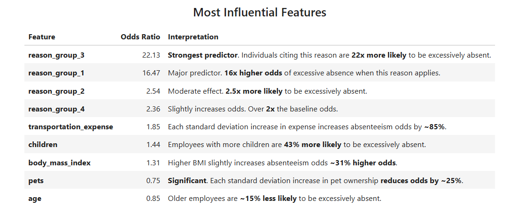
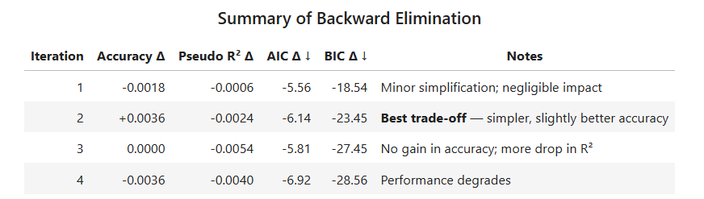
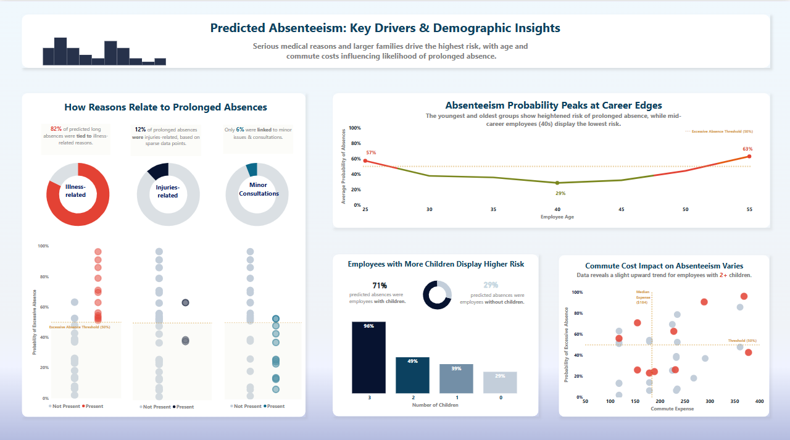

<h1 align='center'>Logistic Regression Model for Predicting Employee Absenteeism</h1>

This repository contains a machine learning pipeline for building, evaluating, and integrating a **logistic regression model** that predicts whether an employee is likely to be **excessively absent from work (3+ hours),** with predicted output visualized in **Power BI**. The final result is an **integration-ready, portable module** for predicting new employee records.


## Project Objective

The goal is to create a data-driven model to:

* **Identify high-risk employees** based on various personal, work-related, and behavioral factors.
* **Predict future absenteeism** probability.
* **Provide insights** into what features most strongly influence absenteeism behavior.


## Repository Structure
```bash
absenteeism_project/
├── code/   # Preprocessing, modeling, and testing
├── data/   # Model's dataset
│   ├── absenteeism_raw_data.csv
│   └── absenteeism_preprocessed.csv
│ 
├── integration/   # Model packaging and prediction scripts
│   ├── model_integration.ipynb
│   ├── scripts/
│   │   └── absenteeism_module.py
│   │  
│   ├── model_artifacts/                   
│   │   ├── model
│   │   └── scaler
│   │ 
│   └── data/   # Raw data for predictions an its results
│       ├── absenteeism_new_data.csv
│       └── absenteeism_predictions.csv
│ 
├── visuals/   # Dashboards, images, and tables
├── README.md
├── requirements.txt
└── .gitignore
```


## Key Features & Workflow

### 1. **Data Preparation**

* Preprocessed data was loaded (assumed cleaned in a prior notebook).
* Created a binary target variable `excessive_absenteeism` for classification.
* Applied a **custom scaler** to scale only the relevant numeric variables.
* Split into training and test sets (80/20).

### 2. **Model Building & Interpretation**

* Trained a **logistic regression** model using `Scikit-learn` and interpreted with `Statsmodels`.
* Evaluated coefficients and **odds ratios** to identify the most influential features.
  

  
* Applied **backward elimination** to simplify the model and remove statistically insignificant predictors.




### 3. **Model Evaluation**

* **Training Accuracy**: \~77.86%
* **Test Accuracy**: \~75.00%
* Indicates strong generalization and **no overfitting**.
* Performance assessed using a **confusion matrix**.

### 4. **Model Serialization**

* Saved the trained model (`model.pkl`) and custom scaler (`scaler.pkl`) using `pickle`.


### 5. **Model Integration**

* Developed a reusable Python class `absenteeism_model` to:

  * Load and preprocess new datasets.
  * Generate **probabilities** and **binary predictions** for excessive absenteeism.
  * Output results in a ready-to-use DataFrame for further analysis or visualization (e.g., in Power BI).


## Output Columns Explained

After running the integration module, you receive a prediction DataFrame with two important columns:

* **`probability`**: The model’s predicted **likelihood** (0–1) that an employee will be excessively absent.
* **`prediction`**: A binary label:

  * `1` = predicted absenteeism is **likely** (probability ≥ 0.5)
  * `0` = predicted absenteeism is **not likely**


## Make Predictions Using the Trained Model

1. Clone the repository:

```bash
git clone https://github.com/shree131/absenteeism_prediction_model.git
cd absenteeism-prediction-model
```

2. Install dependencies:

```bash
pip install -r requirements.txt
```

3. Run the integration notebook or import the module in a Python script:

```python
import sys
sys.path.append('./integration/scripts')
from absenteeism_module import *

model = absenteeism_model('integration/model_artifacts/model', 'integration/model_artifacts/scaler')
model.load_and_clean_data('integration/data/absenteeism_new_data.csv')

predicted_results = model.predicted_outputs()
predicted_results.to_csv('integration/data/absenteeism_predictions.csv', index=False)
```
> Notes:
> * Ensure all relative paths are correct from your working directory.
> * Ensure the new dataset format matches the structure used in training.


## Dashboard Highlights


- Visual breakdown of absenteeism risk by:
  - Medical reasons
  - Commute cost
  - Number of children
  - Age group
- Probability-based insights using logistic regression output


## Next Steps

* Integrate with business dashboards (e.g., Power BI or Tableau) for analysis and presentation.
* Improve model performance using advanced classifiers, feature engineering, or additional data.
* Analyze misclassifications and refine the feature set further.


## Technologies Used

* Python 3
* Pandas & NumPy
* Scikit-learn & Statsmodels
* Pickle for model serialization
* Jupyter Notebook
* Power BI for visualization
